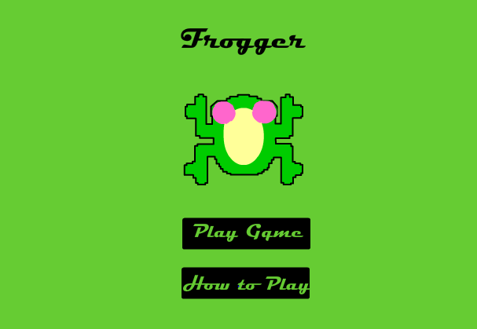
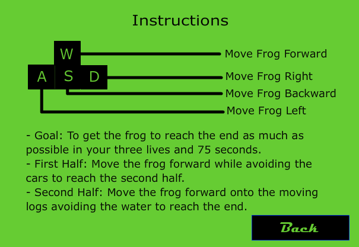
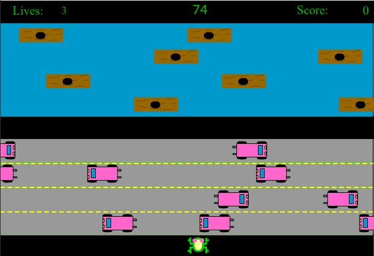
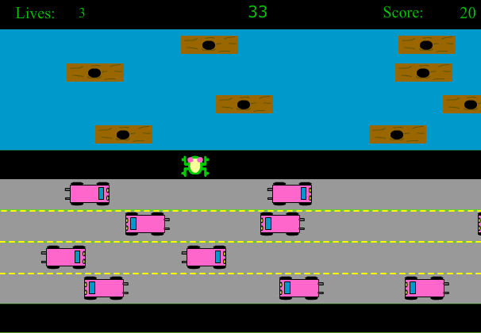
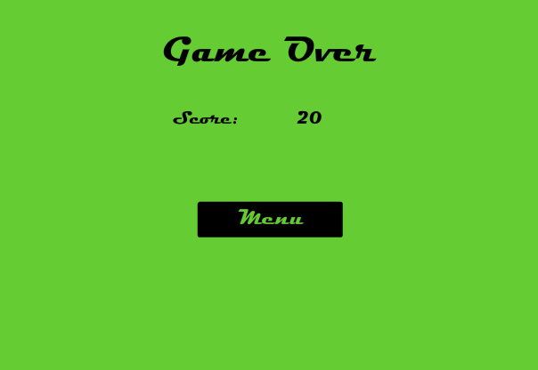

# Frogger
This is a remake of the game Frogger, created using ActionScript 3.0 and Adobe Flash.

### Setup
Download Frogger.fla to get source code file.

To open this file you will need to download [Adobe Animate CC](https://www.adobe.com/ca/products/animate.html)
Note: You can get a 7 day trial to test the game out but will need to purchase a membership after that.

When you have the file opened on Adobe Animate CC press `Ctrl+Shift+Enter`

This should open the swf file allowing you to play the game!

### Game Interface
This game has a total of four frames.

#### 1. Main Menu

#### 2. Instructions

#### 3. Gameplay
Screen at the start of game:

Screen in the middle of the game:

#### 4. Game Over

